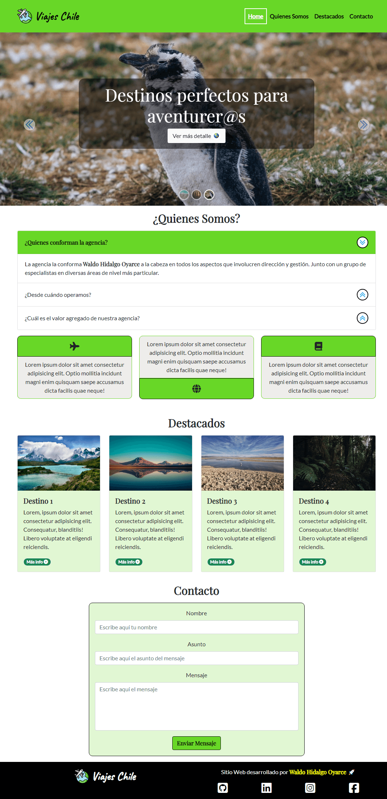

Este repositorio contiene el código con el cual he creado el proyecto solicitado por la prueba a rendir al finalizar el módulo **Fundamentos del desarrollo front-end** de la beca de Talento Digital para Chile **Desarrollo de aplicaciones Full Stack Javascript Trainee V2.0**.

El proyecto pide realizar lo descrito a continuación:

He cumplido con **todo** lo solicitado y he ido mucho más allá personalizando la mayoría de componentes de bootstrap que he utilizado. Mi página web en pantallas grandes se ve de la siguiente manera:

Y en pantallas pequeñas se ve de la siguiente manera:

He utilizado la librería Bootstrap 5, he utilizando iconos de FontAwesome e imagenes del sitio web Icons8 junto con las familias de fonts Caveat, Lato, Playfair y Vollkorn obtenidas desde google fonts.

Los componentes de boostrap que he utilizado son los siguientes:

<ol>
    <li>Accordion y lo he personalizado</li>
    <li>Badge y las he personalizado</li>
    <li>Buttons y los he personalizado</li>
    <li>Card y las he personalizado</li>
    <li>Carousel el cual he personalizado en un 100%</li>
    <li>Navbar la cual he personalizado</li>
    <li>Tooltips no personalizados y un tooltip personalizado ubicado en mi nombre en el footer</li>
    <li>Popover personalizado ubicado en mi nombre en el footer</li>
</ol>

El tooltip que he personalizado es el siguiente:

El popover que he personalizado es el siguiente:

Además de lo anterior, he utilizado javascript para agregarle diversas funcionalidades adicionales:

# 1. Funcionalidad Padding Automatico en base a altura de header

Esta funcionalidad permite agregar un padding automatico en base a la altura del header considerando el icono logo del header y el menu hamburguesa. Se pide en el proyecto crear un navbar **fijo** el cual se superpone a la primera sección. Para evitar lo anterior he creado una funcionalidad que, de manera automática, calcula la altura de un contenedor determinado del header.
El código que he utilizado es el siguiente:

# 2. Formato al seleccionar elementos del menú en el navbar

Cada vez que selecciono algún link del navbar, se aplica una clase con estilos especificos. Antes de aplicar estilos al elemento solucionado, remuevo la clase con los estilos recorriendo cada nodo del menú y procedo a agregar dicha clase al item del menu seleccionado.

# 3. Scroll personalizado a top de secciones

Como se esta usando un navbar fijo, al hacer click sobre algún item del menú el navbar se superpone al top de cada sección. Para evitar lo anterior, le resto, a la seccion donde se ha desplazado la página al hacer scroll, la altura de un contenedor del header. El código es el siguiente:

# 4. Botón para subir al top de la página

La funcionalidad que he creado permite hacer click en un botón que se muestra cuando no se esta en el top de la página web de modo tal que permite subir al top de la página. Cuando se esta en el top de la página web el botón no se muestra, en todo el resto de posiciones de la página web el botón se muestra. La funcionalidad la creo realizando cálculos a partir de la API del DOM. El código es el siguiente:

# 5. Tooltip personalizado

He escrito el siguiente código siguiendo la documentación para crear un tooltip con estilos personalizados:

# 6. Popover personalizado

He escrito el siguiente código siguiendo la documentación para crear un popover con estilos personalizados:

